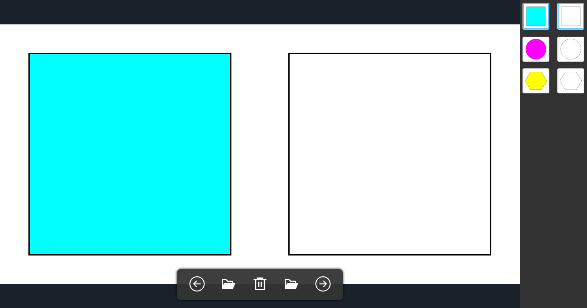

# diff-image
## 概要
2つのフォルダ内にある画像を開くアプリケーション。





## 対応環境
* Windows

## 実行
```bash
npm start
```
## パッケージング
```bash
npm run package
```
`release/build/` 内にインストール用のexeファイルが作成される。
## インストーラー
[ここから](https://les-tav.com/products/DiffImageSetup.exe)Windows用のインストーラーをダウンロード

## アプリの操作方法

1. 左右それぞれのエリアにファルダをドラッグ&ドロップすると、ファルダ内の画像がすべて読み込まれ、<br>左側にサムネイルで表示されます。<br>
2. 左右のボタンまたはサムネイルの画像をクリックすることで同時に2つの画像が切り替えることができます。<br>
3. 削除ボタンを押した際も2つの画像が同時に削除されます。

